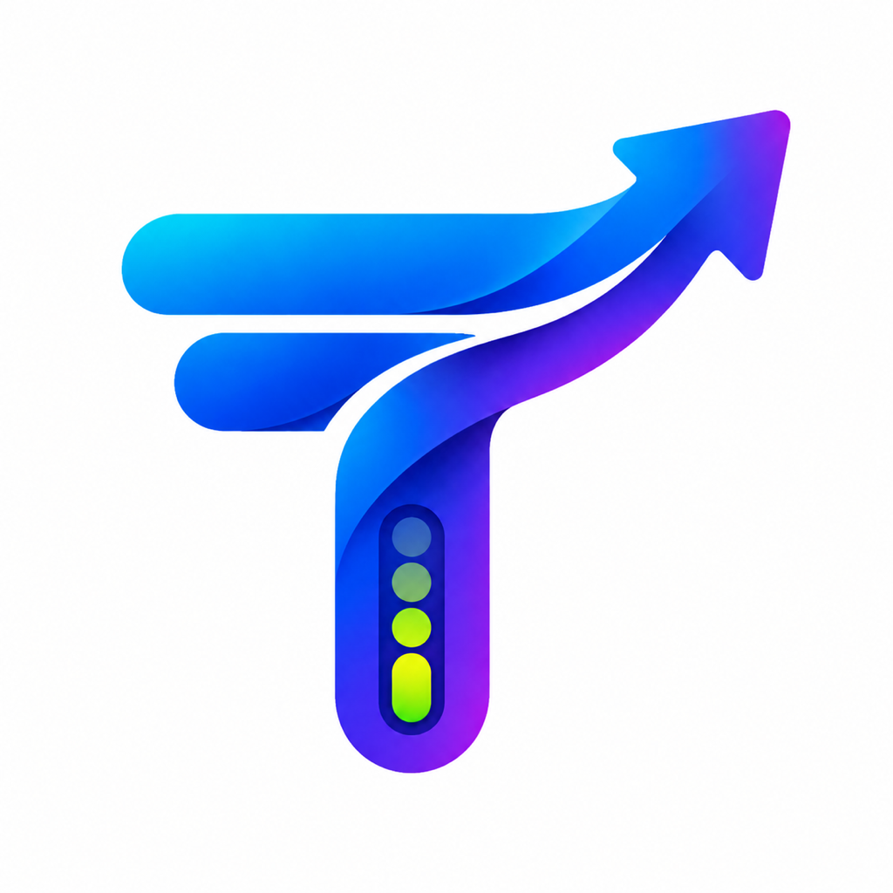
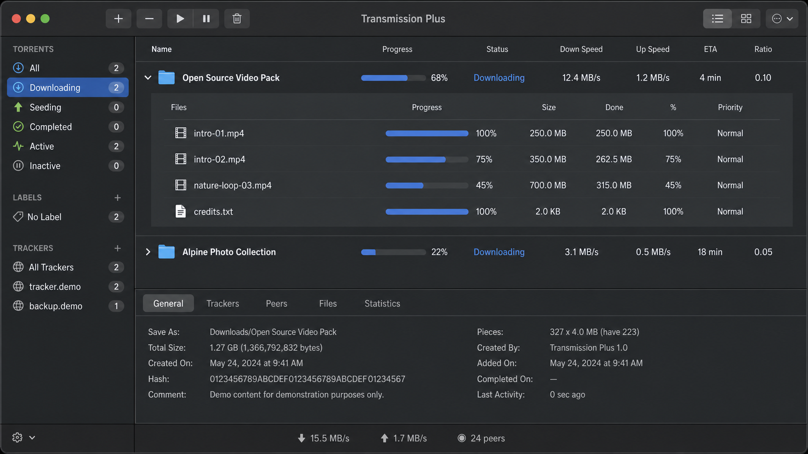
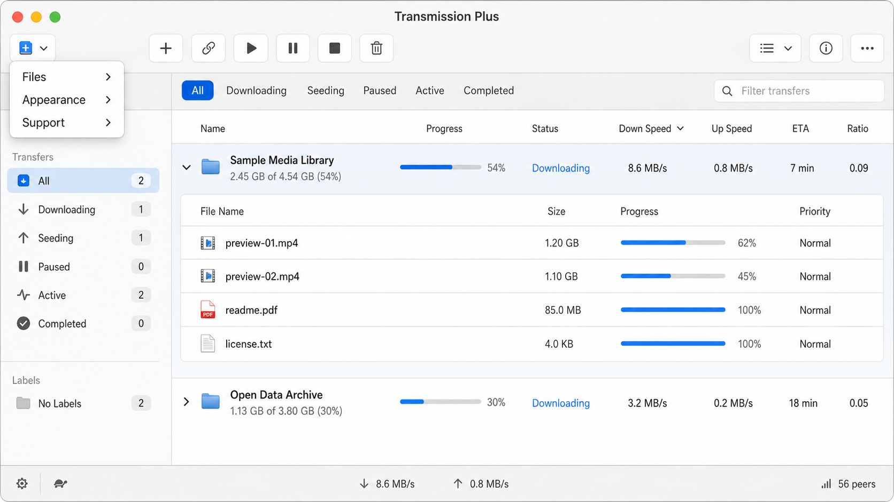

  

<h1 align="center">Transmission Plus</h1>

  A refreshed macOS experience for <a href="https://github.com/transmission/transmission">Transmission</a>. 
  Clear progress, quick file access, and a focused light or dark interface.

  <a href="https://github.com/ADaM-sync/transmission/actions/runs/32644919344/artifacts/9494683875"><strong>Download the current macOS build</strong></a>
  &nbsp;·&nbsp;
  <a href="https://github.com/sponsors/ADaM-sync">Support Adam A</a>
  &nbsp;·&nbsp;
  <a href="https://github.com/ADaM-sync/transmission">Star the project</a>

> [!IMPORTANT]
> Transmission Plus is an independent, unofficial modification of Transmission for macOS. The current build is unsigned, so macOS may ask you to approve it the first time it opens.

## Highlights

- **Progress you can read at a glance** — clear percentage bars in the transfer list, with download and upload speeds, ETA, and seeds or peers alongside them.
- **Inline file browser** — click a transfer or folder to expand its nested files directly below the list; no separate inspector window required.
- **Per-file progress** — every nested file has its own matching progress bar and percentage, so it is easy to see what is still downloading.
- **Cleaner control** — reorder transfer columns, add a torrent from a file or URL, filter files, and change download priority without leaving the main window.
- **Light, dark, or system appearance** — switch from the toolbar or the **Transmission Plus → Appearance** menu.
- **A proper Plus menu** — quick access to the file panel, feature notes, Adam A’s GitHub page, and the donation links.

## In action

  

  

## Install the current build

1. Download and extract the **Transmission-Plus-DMG** ZIP from the link above.
2. Open the DMG and drag **Transmission Plus.app** to Applications.
3. If macOS blocks the first launch, Control-click the app, choose **Open**, then confirm. You may need to restart once after approving it.

The Actions download is for testing and can expire. A permanent release download will be added once the project is ready for a signed release.

## Support

Transmission Plus is free to use. If the work saves you time, you can support Adam A through [GitHub Sponsors](https://github.com/sponsors/ADaM-sync). If you like the project, a GitHub star helps other macOS users find it.

## About the original project

Transmission Plus builds on the excellent [Transmission](https://transmissionbt.com/) BitTorrent client, which is MIT licensed. This fork keeps Transmission’s torrent engine while refining the macOS interface; it is not affiliated with or endorsed by the Transmission project.

For the original project’s development and build documentation, see [Transmission’s documentation](docs/README.md).
